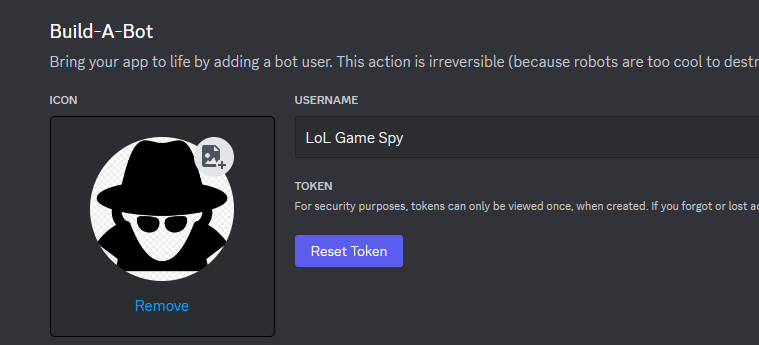
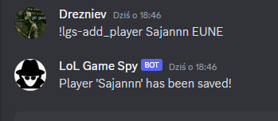

<h1 align="center">
  <br>
  
  <br>
  LoL Game Spy
  <br>
</h1>

<h4 align="center">Discord bot to spy on your friends LoL games</h4>

<p align="center">
  <a href="#key-features">Key Features</a> •
  <a href="#how-to-use">How To Use</a> •
  <a href="#credits">Credits</a> •
  <a href="#license">License</a>
</p>

<center>


</center>

## About
Are you tired of checking your friends LoL profiles?

Wanna know right away how they did in the game?

Well, look no further.


This bot was created as a fun project, to learn more about discord bots and RIOT API. 

Also to git gut at Python.

**_Any feedback is appreciated!_**

## Key Features

* Displays given players stats in discord chat
  - Player name
  - Game mode
  - Champion
  - Kills, deaths, assists
  - KDA
  - Damage dealt to champions 
* Checks for new games every minute
* Stores data in a case of bot restart
* Creates backup every 24 hours
* Works on simple commands
* Easy to use
* Uses minimal API calls
* Easy to setup and run
* Easy to modify and add new features
* Currently works with EUNE, EUW and NA regions

## How To Use

To clone and run this application, you'll need [Git](https://git-scm.com) (optional, if you just download the repo) and [Python](https://www.python.org/) (required) installed on your computer. 

You will also need to create a discord bot (you need to generate bot token) and get a RIOT API key.
[Discord Developer Portal](https://discord.com/developers/applications)



[RIOT API](https://developer.riotgames.com/)


### Installation

```bash
# Clone this repository
$ git clone https://github.com/drezniev/lol-game-spy

# Go into the repository
$ cd lol-game-spy

# Linux/macOS
python3 -m pip install -U discord.py

# Windows
py -3 -m pip install -U discord.py
```

### Setup
Once you had RIOT API KEY and BOT Token, create a file ".env" in the same directory as the bot and paste the following:

```bash
RIOT_API_KEY="<Your RIOT KEY>"
DISCORD_BOT_TOKEN="<Your Discord Bot Token>"
```

> **!IMPORTANT!** You should never use your token or key in the code, as it can be easily stolen.


### Running

To run, while in directory - simply type:

```python
python lol-game-spy.py
```

### Adding bot to your server

Once you have your bot running, you can add it to your server by going to the link generated by discord developer portal.

> **!IMPORTANT!** You need to add below permissions for your bot to works.


Others can use the same link to add your bot to their servers.

### Usage

Once you have your bot running and added to your server, you can use the following commands:

```bash
!lgs-help #Displays help message (commands available) 
!lgs-set_channel <channel_id> #Sets channel for bot to post messages in
!lgs-add_player <player_name> <region>  #Adds player to the list
!lgs-remove_player <player_name>  #Removes player from the list
!lgs-list_players #Displays list of tracked players
```
> Keep in mind that bot will start sending messages only if the channel is set and there are players in the list.

Example use:



## Credits

This boi uses the following:

- [Python](https://www.python.org/)
- [Discord.py](https://github.com/Rapptz/discord.py/)
- [RIOT API](https://developer.riotgames.com/)

## License

MIT

---

> GitHub [@drezniev](https://github.com/drezniev) &nbsp;&middot;&nbsp;
